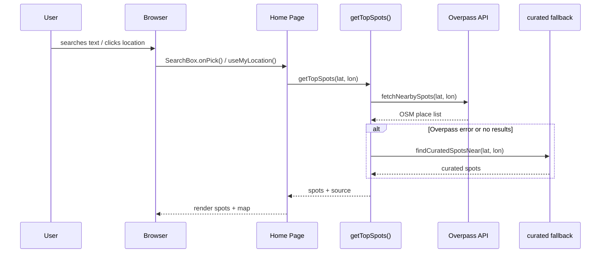
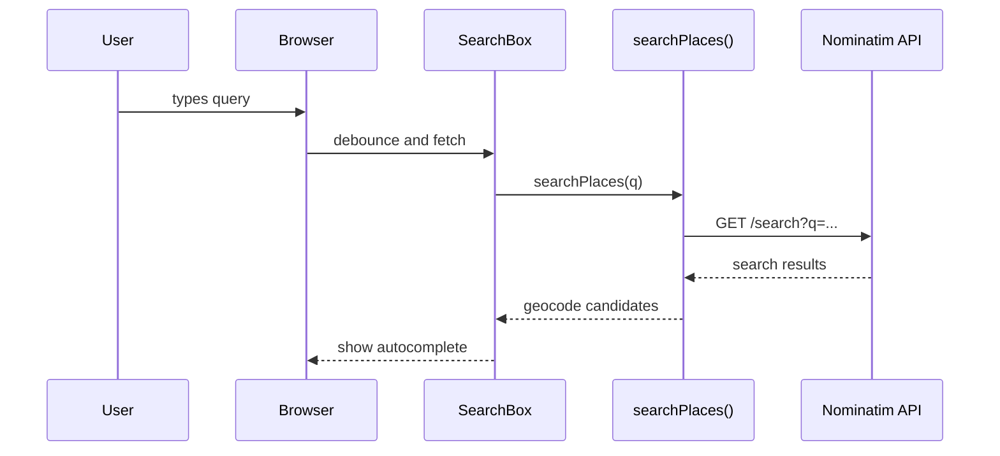
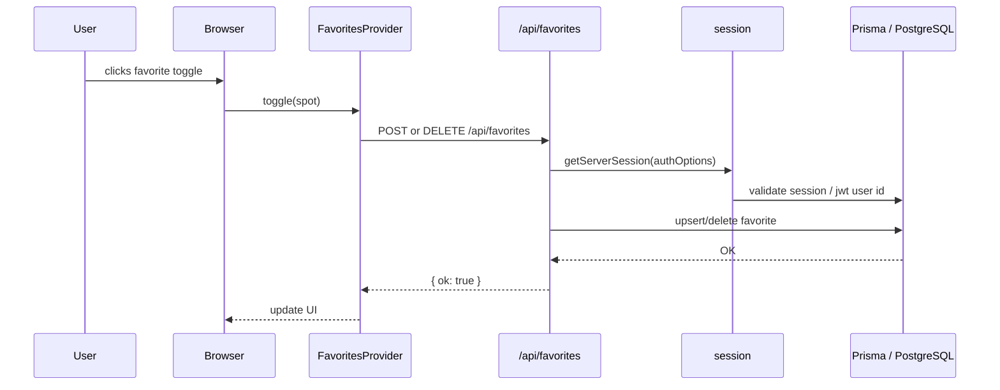
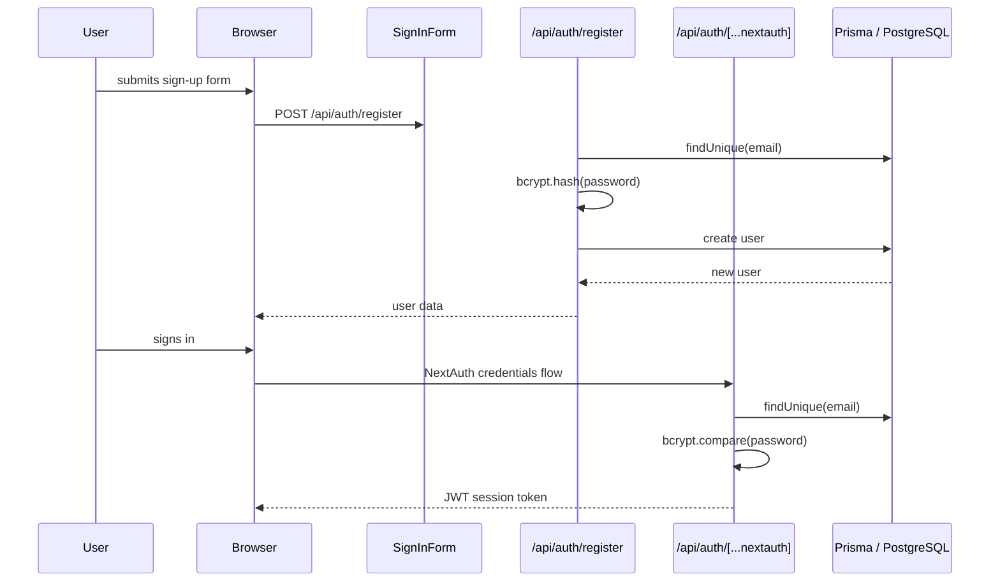

# Kashiphilia Architecture

## Overview

`Kashiphilia` is a Next.js 13 application that helps users discover nearby tourist spots and save favorites. The app combines:

- Client-side location search + geolocation.
- External place discovery via OpenStreetMap services.
- User authentication and favorites persistence via Prisma/PostgreSQL.
- Local guest favorites in `localStorage` when unauthenticated.

## High-Level Architecture

Layers:

1. UI / Client
   - `src/app/page.tsx`
   - `src/components/SearchBox.tsx`
   - `src/components/SpotCard.tsx`
   - `src/components/MapLoader.tsx`
   - `src/app/signin/SignInForm.tsx`

2. App Services
   - `src/lib/geocode.ts` — Nominatim search.
   - `src/lib/overpass.ts` — Overpass places query.
   - `src/lib/spots.ts` — spot selection and curated fallback.
   - `src/lib/favorites.tsx` — favorites API wrapper and localStorage fallback.
   - `src/lib/auth.ts` — NextAuth credential provider config.
   - `src/lib/prisma.ts` — Prisma client singleton.

3. Server API Routes
   - `src/app/api/auth/register/route.ts`
   - `src/app/api/auth/[...nextauth]/route.ts`
   - `src/app/api/favorites/route.ts`

4. Database
   - `prisma/schema.prisma`

5. External APIs
   - Nominatim geocoding: `https://nominatim.openstreetmap.org/search`
   - Overpass place discovery: `https://overpass-api.de/api/interpreter`

## Sequence Diagrams

### 1. Location Search Flow



### 2. Geocode Search Flow



### 3. Favorites Flow (Authenticated)



### 4. Registration / Sign-in Flow



## API Details

### `POST /api/auth/register`

Source: `src/app/api/auth/register/route.ts`

Request body:

- `email` (string, required)
- `password` (string, required, min 6 chars)
- `name` (string, optional)

Behavior:

- normalizes email to lowercase
- rejects if email missing or password too short
- checks `prisma.user.findUnique({ where: { email } })`
- hashes password with `bcryptjs`
- inserts a `User` record

Response:

- `200` with `{ id, email, name }` on success
- `400` with error message for invalid input
- `409` if email already exists
- `500` on unexpected server error

### `POST /api/auth/[...nextauth]`

Source: `src/app/api/auth/[...nextauth]/route.ts`

Used by NextAuth for:

- sign in
- sign out
- session refresh

Auth provider:

- `CredentialsProvider`
- validates user via `prisma.user.findUnique({ where: { email } })`
- compares password with `bcrypt.compare`
- returns `{ id, email, name }` on success

Session strategy:

- `jwt`
- JWT payload includes `token.id`
- session callback attaches `token.id` to `session.user.id`

### `GET /api/favorites`

Source: `src/app/api/favorites/route.ts`

Behavior:

- calls `getServerSession(authOptions)`
- returns empty favorites if no authenticated user
- fetches favorites for authenticated user:
  - `prisma.favorite.findMany({ where: { userId }, orderBy: { createdAt: "desc" } })`
- converts `Favorite` rows into `Spot` objects

Response:

- `{ favorites: Spot[] }`

### `POST /api/favorites`

Source: `src/app/api/favorites/route.ts`

Request body accepts either:

- modern `Spot` payload: `{ id, name, lat, lon }`
- legacy payload: `{ spotId, spotName, spotLat, spotLon }`

Behavior:

- requires authenticated session
- validates all required fields
- uses Prisma `upsert`:
  - where `userId_spotId`
  - create `Favorite` record if missing
  - do nothing on update

Response:

- `{ ok: true }`
- `401` if not signed in
- `400` if payload missing fields
- `500` on save error

### `DELETE /api/favorites`

Source: `src/app/api/favorites/route.ts`

Request body:

- `{ spotId }`

Behavior:

- requires authenticated session
- deletes favorites matching `userId` and `spotId`
- uses `prisma.favorite.deleteMany`

Response:

- `{ ok: true }`
- `401` if not signed in
- `400` if `spotId` missing

## External API / "Any API" Calls

### `src/lib/geocode.ts`

Function: `searchPlaces(query, limit, signal)`

External endpoint:

- `GET https://nominatim.openstreetmap.org/search`

Request parameters:

- `q` = search query
- `format=json`
- `addressdetails=0`
- `limit` = number of results
- `dedupe=1`

Headers:

- `User-Agent: Kashiphilia/0.1 (tourist-spot-finder)`
- `Accept: application/json`

Usage:

- `src/components/SearchBox.tsx` calls `searchPlaces` when the user types a query.
- Returns `GeocodeResult[]` used to choose a location for spot discovery.

### `src/lib/overpass.ts`

Function: `fetchNearbySpots(lat, lon, radiusKm, limit, signal)`

External endpoint:

- `POST https://overpass-api.de/api/interpreter`

Payload:

- Overpass QL query searching for tourism, historic, and place-of-worship OSM objects in the radius.
- Response `out center 30;` returns center coordinates for ways/relations.

Headers:

- `User-Agent: Kashiphilia/0.1 (tourist-spot-finder)`
- `Content-Type: application/x-www-form-urlencoded`

Usage:

- `src/lib/spots.ts` calls `fetchNearbySpots`.
- On failure, fallback to curated spots via `src/lib/curated.ts`.

## App Service Call Map

### Search flow

- `src/app/page.tsx` invokes `getTopSpots(lat, lon)`
- `src/lib/spots.ts` calls `fetchNearbySpots()`
- `src/lib/overpass.ts` calls Overpass API
- if no results or error, `src/lib/curated.ts` returns fallback spots
- `page.tsx` renders results in `SpotCard` and `MapLoader`

### Geocode flow

- `src/components/SearchBox.tsx` invokes `searchPlaces(q)`
- `src/lib/geocode.ts` calls Nominatim
- user selects a result and `page.tsx` requests spots for selected coordinates

### Favorites flow

- `src/lib/favorites.tsx` loads favorites from server if authenticated
- `/api/favorites` reads/writes `Favorite` rows via Prisma
- unauthenticated users use `localStorage` under `kashiphilia.favorites.v1`

### Auth flow

- `src/app/signin/SignInForm.tsx` posts to `/api/auth/register`
- registration writes users to DB
- sign in uses `/api/auth/[...nextauth]`
- session state is managed by NextAuth JWT strategy

## Database Schema

Source: `prisma/schema.prisma`

```prisma
model User {
  id        String    @id @default(cuid())
  email     String    @unique
  name      String?
  password  String
  createdAt DateTime  @default(now())
  favorites Favorite[]
}

model Favorite {
  id        String   @id @default(cuid())
  userId    String
  spotId    String
  spotName  String
  spotLat   Float
  spotLon   Float
  createdAt DateTime @default(now())
  user      User     @relation(fields: [userId], references: [id], onDelete: Cascade)

  @@unique([userId, spotId])
  @@index([userId])
}
```

### Schema notes

- `User.email` is unique and is the authentication lookup key.
- `User.password` stores the bcrypt hash.
- `Favorite` is a join table for saved spots.
- `Favorite` uses `userId + spotId` uniqueness to prevent duplicate saved spots.
- `Favorite.spotName`, `spotLat`, and `spotLon` are persisted to avoid re-fetching place details.

## Environment Variables

- `DATABASE_URL` — PostgreSQL connection string used by Prisma.
- `NEXTAUTH_SECRET` — secret used by NextAuth JWT session signing.

## Useful File Map

- `src/app/page.tsx` — home page UI, search, geolocation, spot retrieval.
- `src/components/SearchBox.tsx` — search UI and Nominatim query.
- `src/lib/geocode.ts` — Nominatim client.
- `src/lib/overpass.ts` — Overpass client.
- `src/lib/spots.ts` — spot ranking and fallback behavior.
- `src/lib/favorites.tsx` — favorites state + API wrapper.
- `src/lib/auth.ts` — NextAuth options.
- `src/app/api/auth/register/route.ts` — sign-up API.
- `src/app/api/auth/[...nextauth]/route.ts` — NextAuth API.
- `src/app/api/favorites/route.ts` — favorites endpoints.
- `prisma/schema.prisma` — persistent data model.

## Notes for Developers

- Favorites are stored locally for unauthenticated users and server-side for authenticated users.
- There is no server-side proxy for spot discovery; the browser calls Nominatim and Overpass directly.
- If Overpass fails, the app still works with curated landmarks.
- The only database writes are user registration and favorites create/delete.
- Authentication is credential-based and uses bcrypt password hashing.
